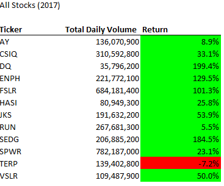
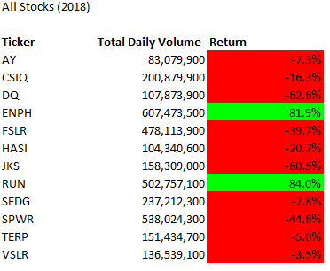
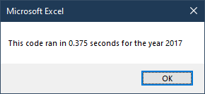
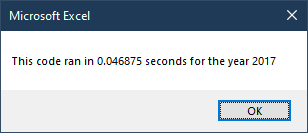
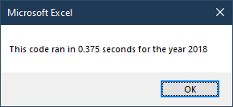
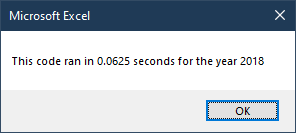

# An Analysis of Selected Stock in 2017 and 2018

## Overview of Project

The objective of the project is the compile script that summarizes the performaces of the selected stocks between 2017 and 2018. The analysis compares the stock perfomance base on yearly return on stock price, as well as related data points, such as total yearly trading volume. Through the projects, a comparison of the scripts run-time performance was also performed. Additional brainstorming and improvement were made to the scripts by using the run-time as benchmark. 

## Result of the Analysis

**_Stock Price Analysis_**

As the screenshot of the performance summary shown below, 2017 was a tremendous year for majority of the stocks selected. Out of the 12 stocks selected, 11 experienced a positive year-over-year price increases. In fact, both DQ and SEDG observed an near 200% increased its share value in FY 2017. 

On the other hand, overall market performances for the stocks selected took a negative turn in 2018. Out of the 12 stocked selected, 10 experienced a negative year-over-year price increases. Although ENPH and RUN was able to withstood the bleak market conditions and maintained a respectivable 80% share increases, the rest of the stocks in selection had a avearge of 27& decrease in share valuation.

There were no clear correlation between stock performance to trading volume between 2017 and 2018. 

**_VBA Script Performance Analysis_**

On average, the original VBA script required 0.375 second to execute, as compared with the refactored VBA scripts's 0.055 second to execute. By putting more thoughts into the structure of the refactored VBA scripts, 0.32 second saved. That's an 85% improvement to the script performance!

**2017 Run-Time Comparison** (0.33 Second, or 88% Improvement)

**2018 Run-Time Comparison** (0.31 Second, or 83% Improvement)

## Summary

In general, refactoring code allows the analyst to build-upon or repurpose the existing codes for new project at hand. By leveraged the existing code structure, the analyst can save tremendous of time he would have spent laying out the initial declaration and definition of each and every variables needed. Although refactoring code is generally encouraged from an effeciency standpoint, adhering to potentially outdated methodology or disorganized code strucuture can be disabling improvement and hindering creavtivity.

While the original VBA script excelled in its simpilicty and ease for understanding, it lacked in efficiency (due to switching back and forth between the Data and Output tabs). On the flip side, the refactored VBA scripts significantly improved the run-time performance (due to first collecting all relevent data in the Data tab, then displaying summary in the Output tab). Althoguht it may come at a cost of additonal complexity, most will agree that it was a fair trade-off for an 85% improvement in effeciency. 

